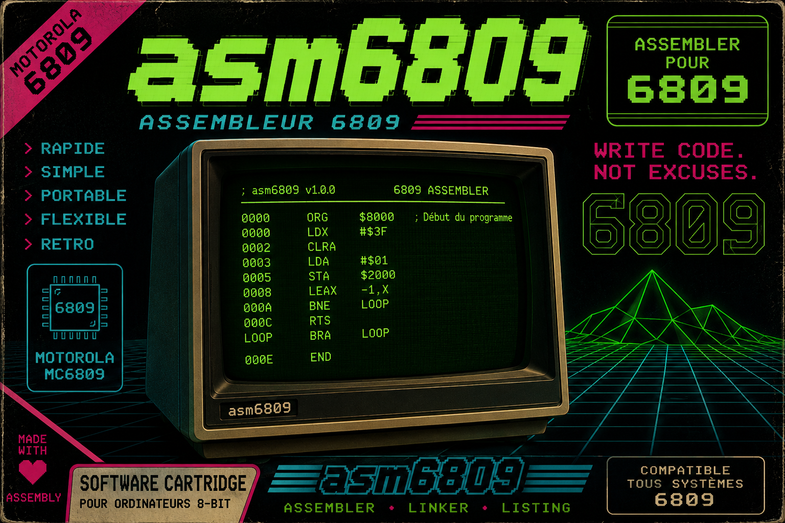

# asm6809 - Assembler for M6809/H6309 Microprocessor



---

## Clone

```bash
git clone https://github.com/jmparis/asm6809.git
cd asm6809
```

## Compilation

```bash
./autogen.sh
./configure --prefix=/home/${USER}/.local

make -j$(nproc)

make install
```

## Usage

```bash
asm6809 -o output.bin input.asm
```

## Example

```asm
        org     $1000
        lda     #$12
        sta     $1001
        ldb     #$34
        stb     $1002
        ldx     #$5678
        stx     $1003
        ldy     #$9abc
        sty     $1005
        ldu     #$def0
        stu     $1007
        lds     #$2345
        pshs    u,y,x,b,a,dp,cc
        puls    cc,dp,a,b,x,y,u
        rts
        end     $1000
```

---
